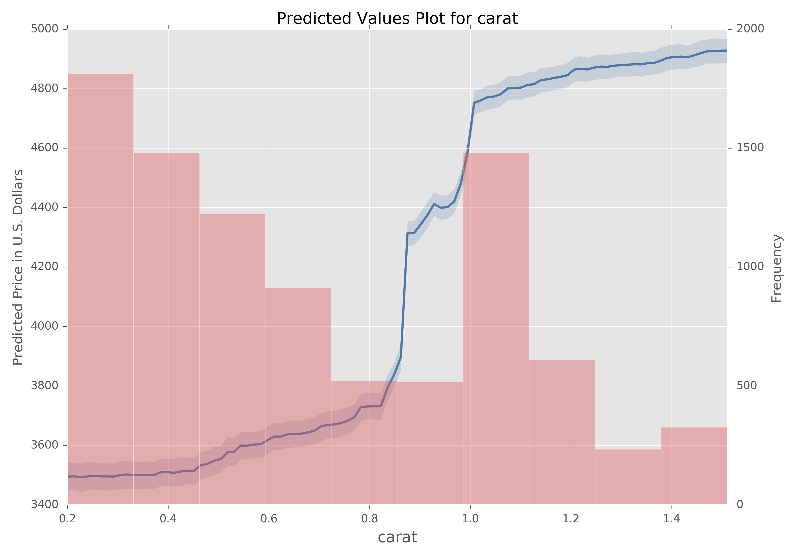
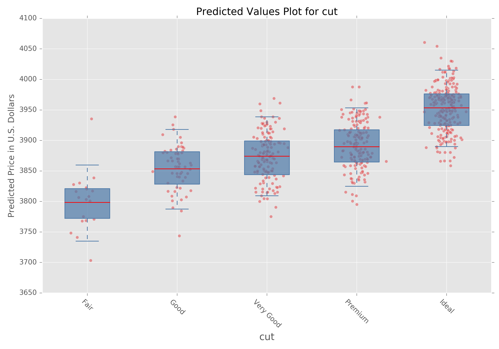
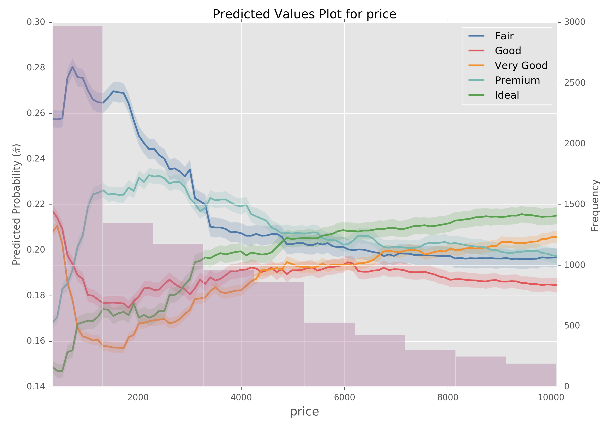

# Random Scripts
This is simply a repository of useful scripts I have written.

## Predicted Value Plot
Script for performing a predicted value plot for a particular feature given a model, dataframe, and column in question.  You can use this script to get a sense for how changing the value of a particular feature will influence your predicted value in the case of regression, or predicted probability in the case of classification.

The following graphic is the resulting plot of using a Random Forest Regressor on the [diamonds dataset](http://docs.ggplot2.org/0.9.3.1/diamonds.html) to identify how different carat values affect the price prediction of a particular diamond.

The function will also work for making predicted value plots for a column containing discrete values; simply pass a `discrete_col=True` argument.  If set, the entire column will be reset to the value of each discrete value and predictions will be made.  The box plot of predictions is then generated from the mean predictions of 1000 bootstrapped samples of those predictions.  There is also an optional parameter for superimposing a jittered scatter plot of bootstrapped means over the box plot (this is turned on by default).

The following graphic is the resulting plot when running the `predicted_value_plot` function on the `cut` column containing discrete values.

This function accommodates classification models to produce predicted probability plots.  Set `classification=True` to indicate that the passed model is a classification model.

Using the same dataset as before, we can build a Random Forest Classifier to predict the `cut` of a diamond.  The following graphic identifies how different values of `price` affect the model's `cut` prediction.

**NOTE**: This function is still under active development.  Work is being done to extend the function's ability to have a multi-class classification model create a plot for a discrete column with grouped box plots.  Stay tuned!
